# Broadcom Account Registration Guide

**Registering a Broadcom Support Portal account involves creating a basic profile on their official site for access to support, downloads, and communities.** This process starts with email verification. 

## Registration Steps
Follow these steps on the Broadcom Support Portal at https://support.broadcom.com:

1. Go to the Broadcom Support Portal homepage.

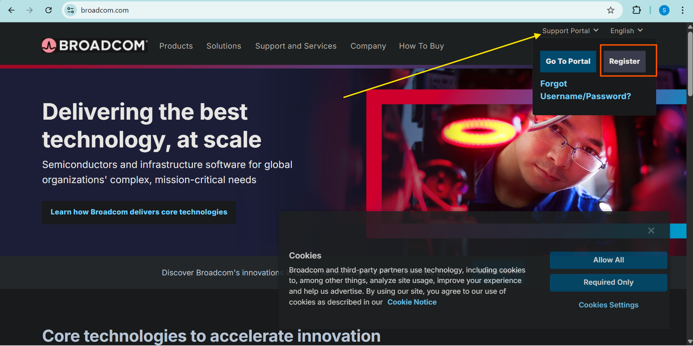

2. Click **Register** in the upper-right corner. 

3. Enter your individual email address, complete the CAPTCHA, and click **Next**. 

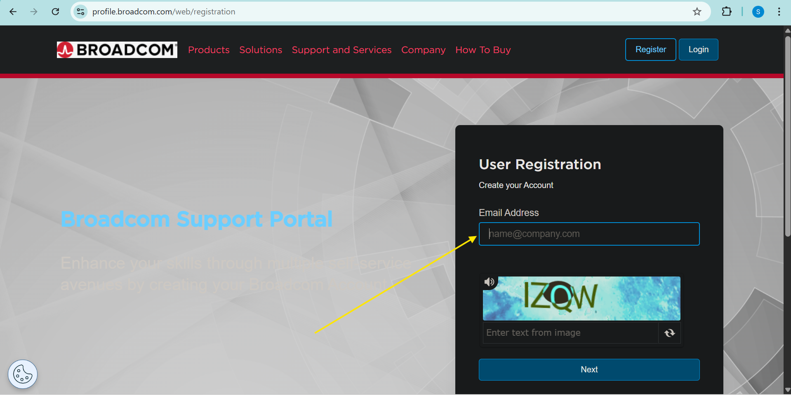

4. Check your email for the verification code from Broadcom, enter it, and click **Verify & Continue** .

5. Fill in your basic information (name, etc.), accept the **Terms of Use**, and click **Create Account** .

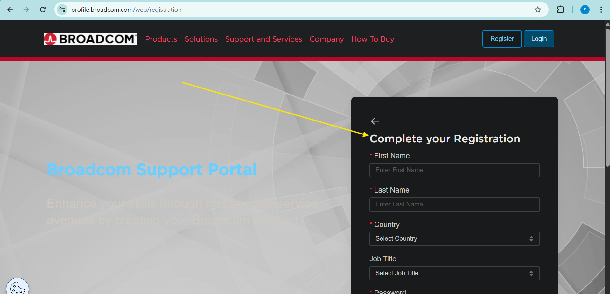

6. After success, click **I'll do it later** to upgrade for case management, downloads, and entitlements. 

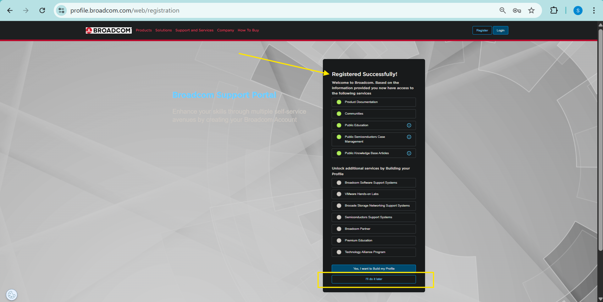

## Log in to the portal.

- Log in at https://support.broadcom.com.

    - - To login (check on the top right)

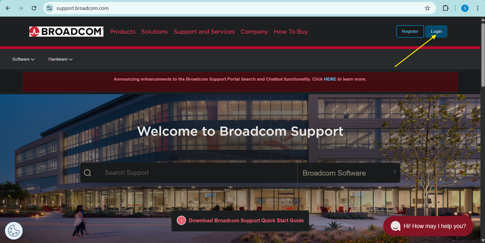

### Steps to Access Downloads
- After logging into the Broadcom Support Portal, navigate to downloads to check for VMware Fusion availability. VMware Fusion Pro is offered as a free download for non-entitled users.

* On the left menu, click **My Downloads**. 

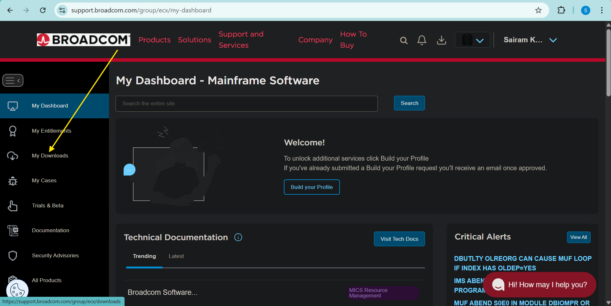

* Look for **Free Software Downloads available HERE** (hyperlink) and click it. 

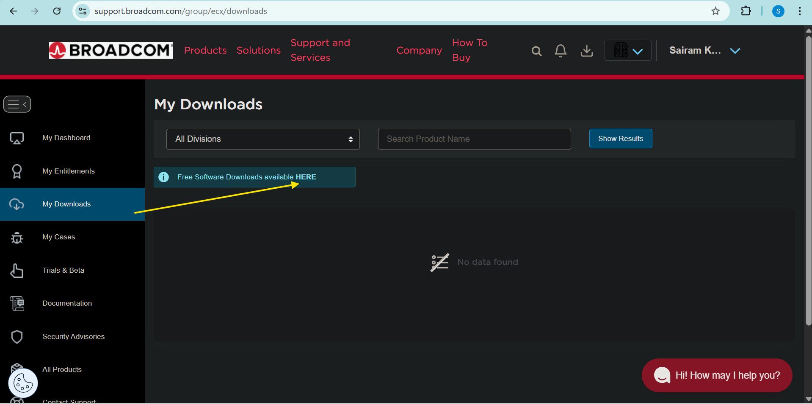

* Search for **"VMware Fusion"**.

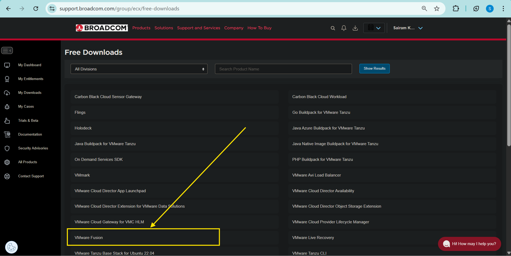

* Click on **VMware Fusion 13**, and Select the latest version (e.g., VMware-Fusion-13.6.4-xxxxxxxx_universal.dmg for macOS universal support.

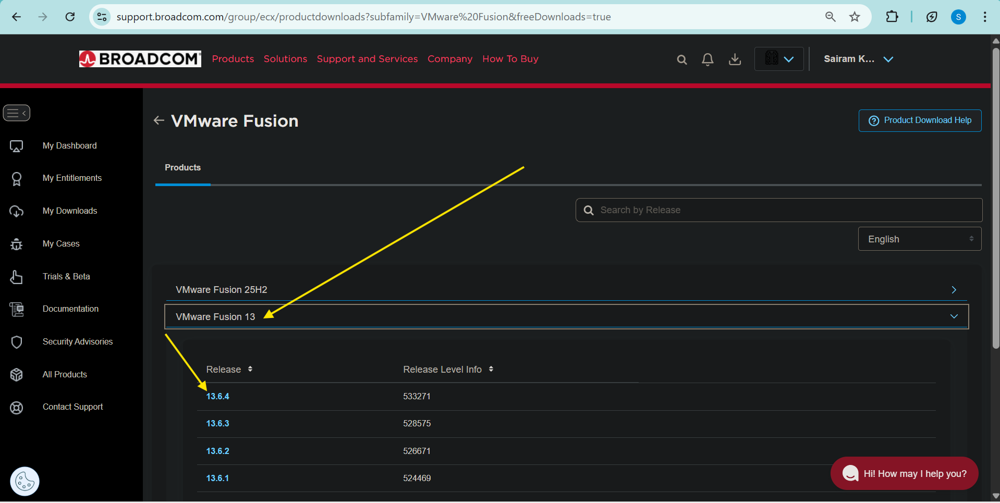

- To accept the terms on the VMware Fusion 13.6.4 download page, follow the below steps. 

* Click the **"Terms and Conditions"** link (usually below the download table) to open it in a **new browser tab**. 

* Review the terms in the new tab, then close it or keep it open—the **"I AGREE" checkbox** will now be **enabled** on the original download tab. 

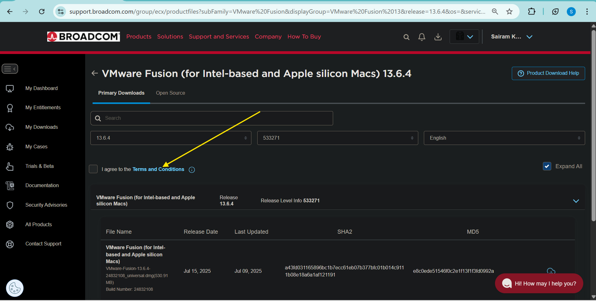

* Switch back to the **previous tab** (Broadcom downloads page).

* **Check the "I AGREE" box**, then click the **download icon** (cloud arrow) next to the desired build (e.g., VMware-Fusion-13.6.4-xxxxxxxx_universal.dmg). 

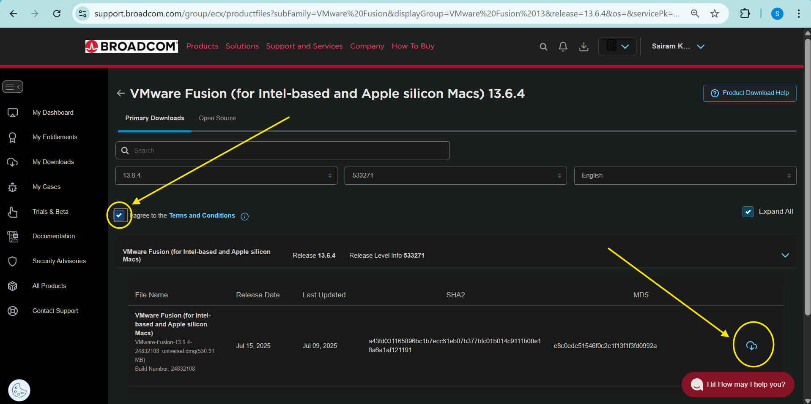

* After clicking the download icon on the VMware Fusion 13.6.4 page, a details form prompts before final download. Fill required fields and submit to proceed. 

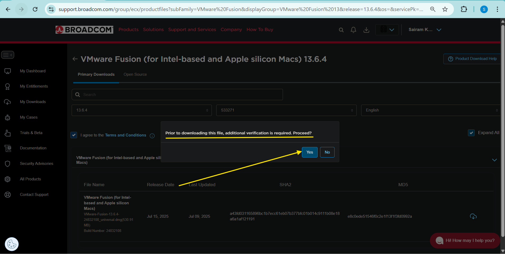

#### Refined Download Prompt Steps
* **Fill Details**: Enter **Name**, **Email** (use your registered Broadcom email), **Company** (optional), and **Phone** (if shown as required) in the "Download Notification" form. 

* **Submit Form**: Check **"I AGREE"** (now enabled), then click **Submit** or **Continue** button.

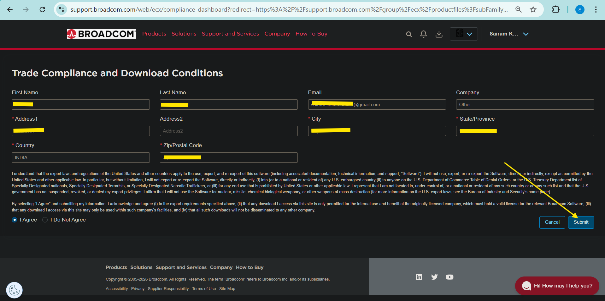

* **Final Download**: Return to the downloads table; click the **download icon** (cloud arrow) again next to **VMware-Fusion-13.6.4-xxxxxxxx_universal.dmg**. 

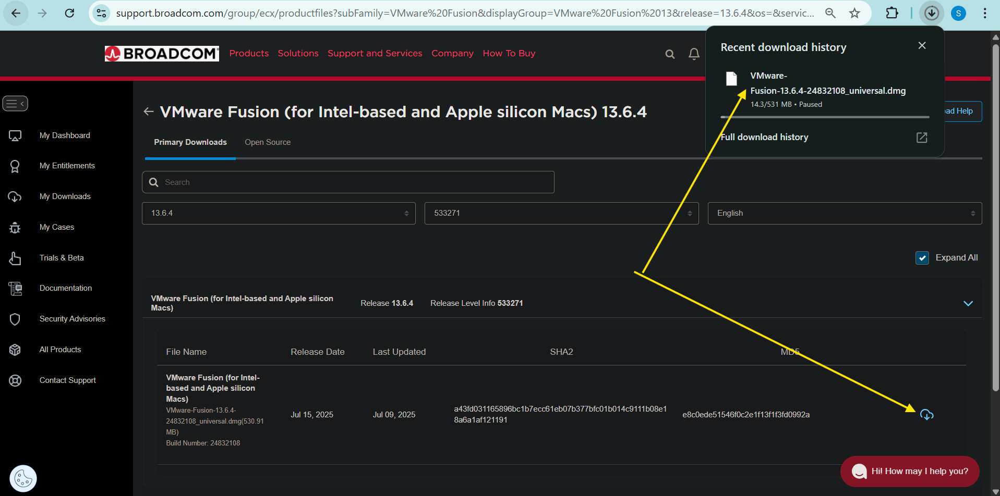

